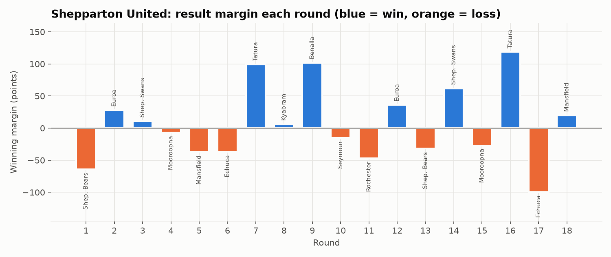
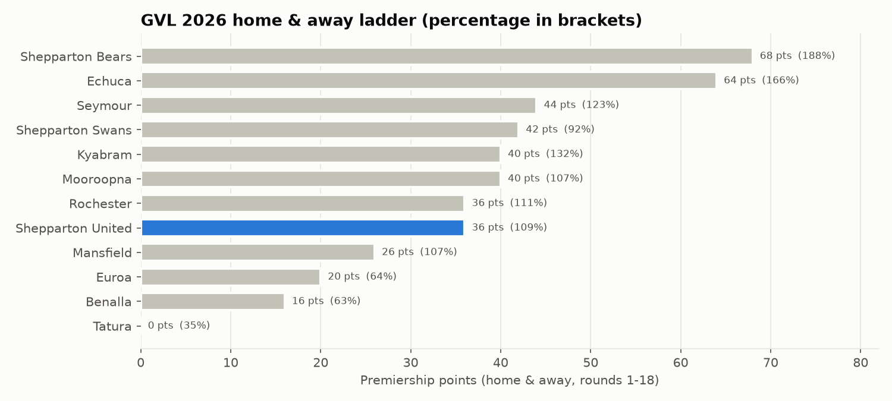
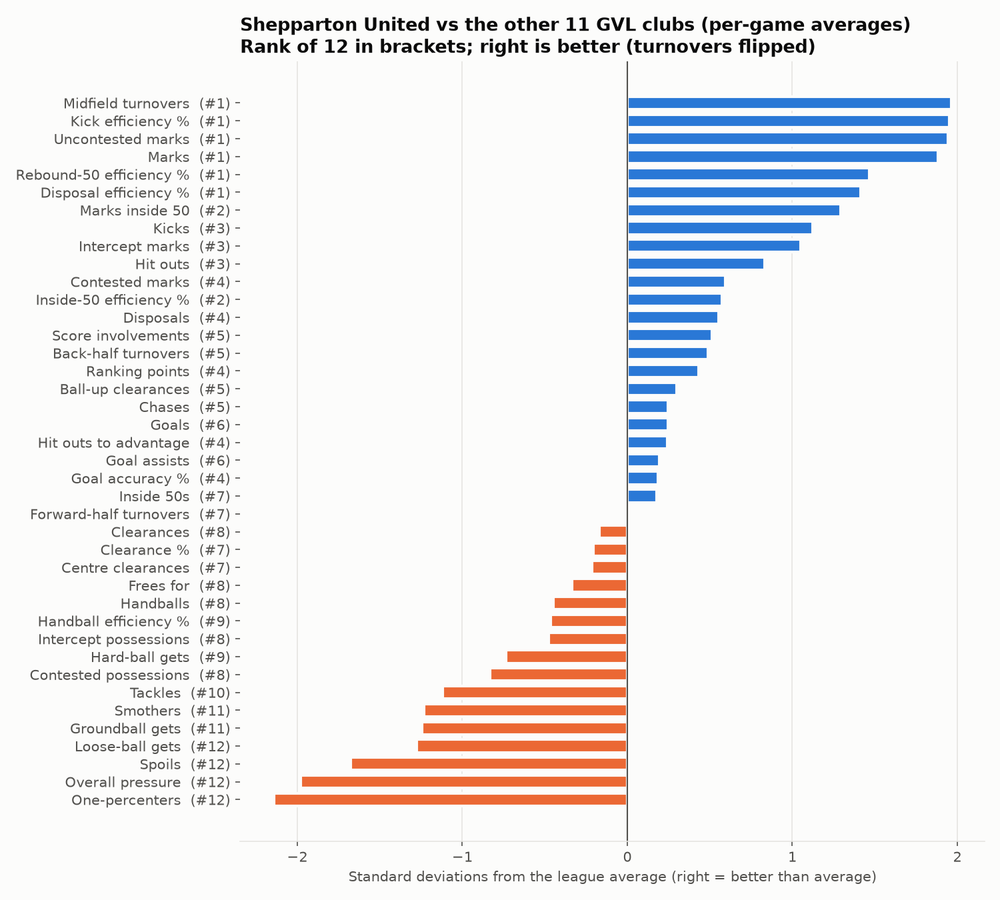
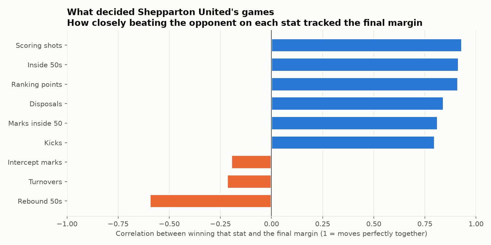
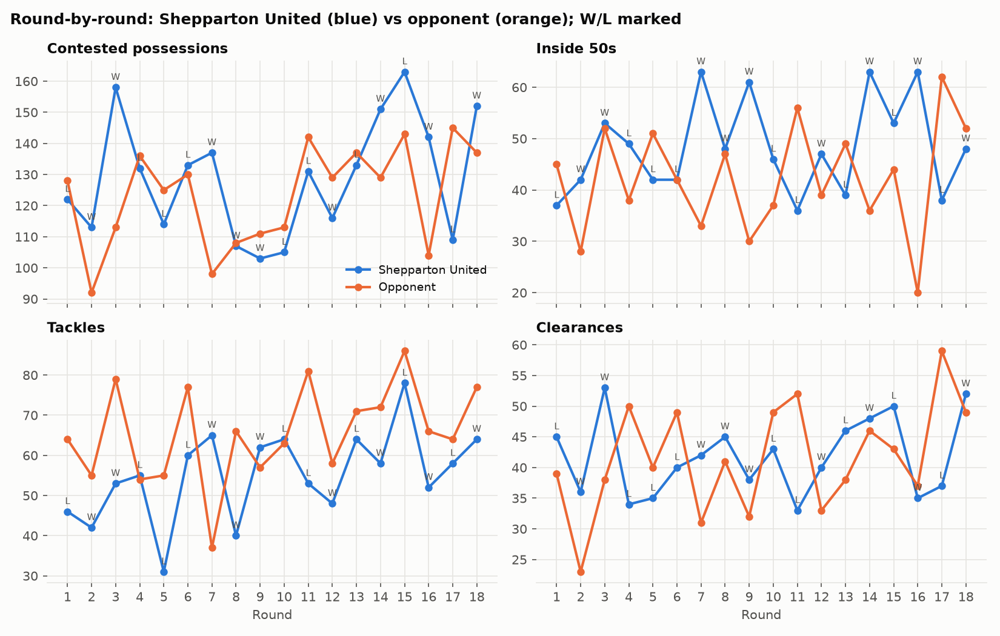
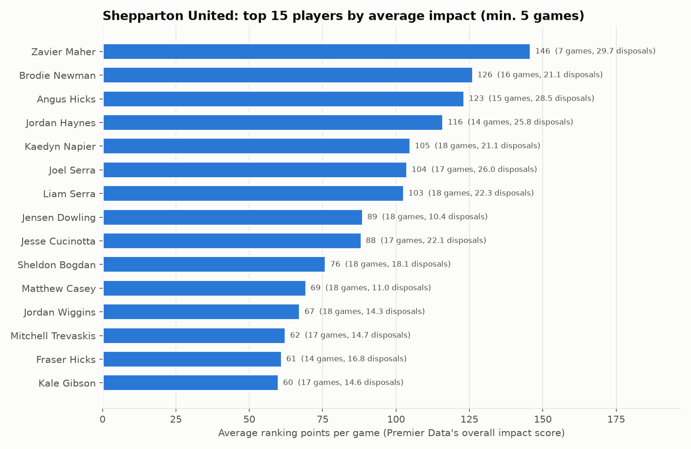
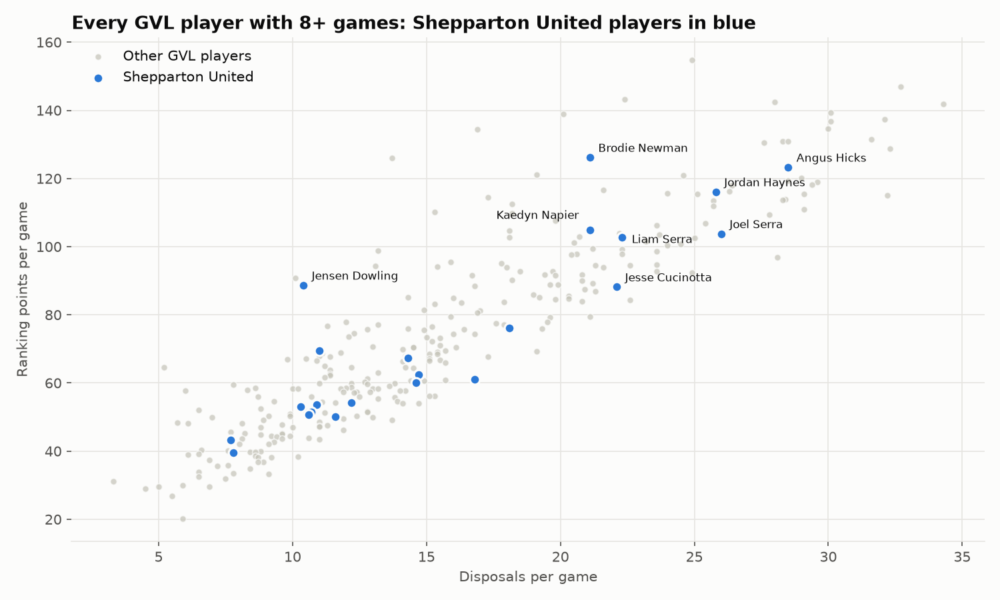
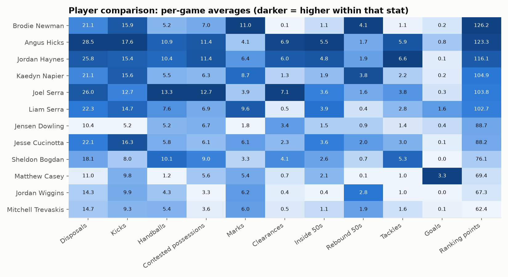
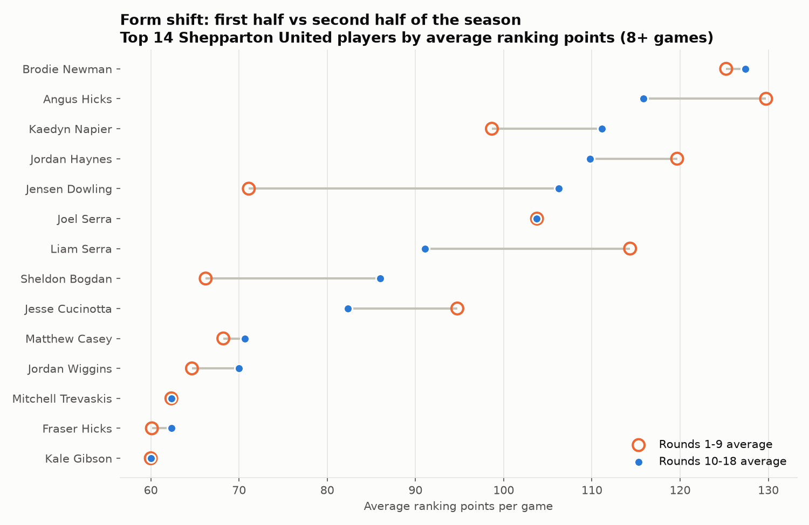

# Shepparton United 2026 season analysis (Goulburn Valley League)

Source: the Premier Data app (pdapp2.advancedhp.com.au), scraped on 25 September 2026 from the Shepparton United club account. The season is finished; Echuca won the grand final on 20 September.

## Key findings in plain language

1. **United finished 8th with 9 wins and 9 losses and missed the finals by one win.** Six teams made the finals. Mooroopna took 6th spot with 10 wins. United scored more than they conceded across the season (108.7%, better than Mooroopna's 107.3%). So one extra win would almost certainly have put them in the finals. The obvious one got away in Round 4, a 7-point loss to Mooroopna.

2. **The season was decided by games against middle-of-the-ladder teams.** United beat the teams below them comfortably. Against the top five they won 3 of 8. The bigger problem was four losses to teams around them on the ladder: Mooroopna twice, Rochester and Mansfield. Those four losses were the difference between 8th and the finals.

3. **United's style: the best marking, cleanest-kicking team in the league.** Out of 12 clubs they ranked **1st** for marks, uncontested marks, kicking efficiency, overall disposal efficiency and fewest midfield turnovers, and **2nd** for marks inside 50. On average they took 22 more marks and had 32 more disposals than their opponents each game.

4. **The big weakness is the hard, defensive side of the game.** United ranked **last (12th)** for overall pressure, one-percenters (spoils, smothers, shepherds), spoils and loose-ball gets, **11th** for groundball gets and smothers, and **10th** for tackles. Opponents laid about **10 more tackles a game** than United.

5. **Wins came from getting the ball forward, not from winning the contest.** The biggest link to the final margin was getting more inside 50s and scoring shots than the opponent. In wins, United averaged **54 inside 50s and 19 marks inside 50**. In losses it was **42 and 11**. Tackle numbers were about the same in wins and losses, so when United lost, the ball simply wasn't getting forward enough.

6. **Goalkicking cost a little.** United converted 50% of their shots on goal and opponents 53%. That's small, but in a season lost by one win it matters.

7. **Standout players:**
   - **Brodie Newman** (defender) ranked **#1 in the whole league** for both marks and intercept possessions per game, and #17 overall for Premier Data's impact score.
   - **Angus Hicks** is the engine of the midfield. He's in the league's top 20 for disposals, clearances, tackles and inside 50s, and #19 overall.
   - **Jordan Haynes** is the **7th-best tackler** in the league and United's most consistent high performer.
   - **Matthew Casey** kicked **3.3 goals a game**, the **3rd-best average** in the league. He was also the player whose output rose most in wins.
   - **Zavier Maher** only played 7 games, but his average impact score (146) would rank **3rd of 294** qualified players in the league if he'd played more.
   - **Liam Serra** was #3 in the league for marks and #18 for goals.

8. **Form across the year:**
   - **Improved in the second half:** Jensen Dowling (+35 impact points a game), Sheldon Bogdan (+20) and Kaedyn Napier (+12).
   - **Dropped off:** Liam Serra (−23) and Angus Hicks (−14), though Hicks stayed among the team's best.

**What to work on:** keep the elite ball use, but lift pressure and tackling around the ball. That's where United is furthest behind every other club. Also focus on turning possession into more inside 50s, because that is what separated United's wins from their losses.

---

## 1. Results and ladder





| | Wins | Games | Avg margin |
|---|---|---|---|
| vs top-5 teams (Bears, Echuca, Seymour, Swans, Kyabram) | 3 | 8 | −21.1 |
| vs everyone else | 6 | 10 | +28.6 |
| Rounds 1–9 | 5 | 9 | +11.2 |
| Rounds 10–18 | 4 | 9 | +1.8 |

The ladder here is rebuilt from all 108 home-and-away results. It matches the ladder shown in the app exactly.

## 2. Team strengths and weaknesses vs the league



Each bar compares United's per-game average with the other 11 clubs. Stats where a high number is bad (turnovers) are flipped so that right is always better. Two stats are left out: frees against (recorded as 0 for every team in the source) and rebound 50s (fewer can simply mean the ball spent less time in defence).

| Stat (per game) | United | League avg | Rank /12 |
|---|---|---|---|
| Marks | 110.4 | 91.8 | 1 |
| Uncontested marks | 96.1 | 78.5 | 1 |
| Kick efficiency % | 64 | 60.2 | 1 |
| Disposal efficiency % | 69 | 67.0 | 1 |
| Midfield turnovers (fewer is better) | 39.0 | 43.7 | 1 |
| Marks inside 50 | 15.1 | 11.9 | 2 |
| Disposals | 349.7 | 339.4 | 4 |
| Contested possessions | 128.9 | 136.6 | 8 |
| Clearances | 41.8 | 42.3 | 8 |
| Tackles | 55.2 | 62.0 | 10 |
| Groundball gets | 77.9 | 86.9 | 11 |
| Overall pressure | 105.2 | 124.2 | 12 |
| One-percenters | 36.3 | 43.3 | 12 |
| Spoils | 13.7 | 17.7 | 12 |

Against their own opponents over the season, United's per-game differentials were:
- Disposals +32
- Marks +22
- Inside 50s +6
- Contested possessions +5.6
- Scoring shots +2.9
- Tackles −10.5
- Pressure acts −6.3
- Goal accuracy −3 percentage points

## 3. What decided United's games



This chart uses United's 18 games. For each stat it measures how closely beating the opponent on that stat moved with the final margin. The strongest links were scoring shots (0.93), inside 50s (0.92), disposals (0.84) and marks inside 50 (0.81). Tackles (0.40) and overall pressure (−0.05) had little or no link. Winning the rebound-50 count went with losing (−0.59), because it means the opponent had the ball in their forward half.

Average per game in wins vs losses (United's numbers):

| | Wins | Losses |
|---|---|---|
| Inside 50s | 54.2 | 42.4 |
| Marks inside 50 | 19.1 | 11.1 |
| Scoring shots | 28.2 | 17.9 |
| Marks | 123.2 | 97.7 |
| Disposals | 371.1 | 328.3 |
| Tackles | 53.8 | 56.6 |
| Turnovers | 66.0 | 71.2 |



## 4. Players





League ranks for United's leading players. Out of 294 GVL players with 8 or more games; a lower number is better.

| Player | Impact score | Disposals | Contested poss. | Clearances | Tackles | Goals | Marks | Inside 50s | Intercepts |
|---|---|---|---|---|---|---|---|---|---|
| Brodie Newman | 17 | 60 | 85 | 281 | 277 | 171 | **1** | 213 | **1** |
| Angus Hicks | 19 | 15 | 26 | 15 | 11 | 59 | 134 | 10 | 84 |
| Jordan Haynes | 29 | 28 | 26 | 24 | **7** | 207 | 31 | 21 | 72 |
| Kaedyn Napier | 47 | 60 | 113 | 127 | 170 | 171 | 6 | 133 | 23 |
| Joel Serra | 50 | 27 | 18 | 13 | 70 | 148 | 148 | 48 | 49 |
| Liam Serra | 54 | 49 | 88 | 205 | 108 | 18 | **3** | 38 | 215 |
| Matthew Casey | – | – | – | – | – | **3** | – | – | – |



### Form and consistency (from the per-game stats of all 18 games)



- **Biggest improvers** (average impact, rounds 1–9 → 10–18):
  - Jensen Dowling: 71 → 106
  - Sheldon Bogdan: 66 → 86
  - Kaedyn Napier: 99 → 111
- **Biggest drops:**
  - Liam Serra: 114 → 91
  - Angus Hicks: 130 → 116
  - Jesse Cucinotta: 95 → 82
- **Most consistent high performers**, where scores varied least from game to game: Jordan Haynes, Kaedyn Napier, Brodie Newman.
- **Players who lifted most in wins vs losses:**
  - Matthew Casey: +47 impact points
  - Angus Hicks: +41
  - Liam Serra: +31
- **Best single games:**
  - Brodie Newman: 201 impact points, Round 6
  - Angus Hicks: 186, Round 7 (36 disposals, 10 tackles, 10 clearances)
  - Stuart Horner: 186, Round 6 (42 disposals, his only game)
  - Zavier Maher: 175, Round 15

## 5. What the account can access

Pages visited, with screenshots in `report/screenshots/`:

| Page | Status |
|---|---|
| Dashboard | Scraped |
| Team Summary | Scraped |
| Squad List | Scraped |
| Fixtures (every round, including finals) | Scraped |
| Leaders (teams and players, averages and totals) | Scraped |
| Match stats pages (Player Stats tab, all 18 United games) | Scraped |
| Match Reports | No report data showed on the page for this account |
| Opposition Analysis | Paid add-on, not bought ($750 + GST) |
| PD Draft | Paid add-on, not bought ($250 + GST) |

Video Library and Vision Editor are video tools with no stats, so I didn't scrape them.

## Data files (`data/`)

| File | Contents |
|---|---|
| `fixtures_results.csv` | Every GVL 2026 game, including finals: round, date, teams, scores |
| `ladder_home_and_away.csv` | Ladder rebuilt from the results |
| `team_match_stats_for/against/differential.csv` | United's team stats in each of their 18 games (60+ stats) |
| `team_season_for_vs_against.csv` | United's season averages vs their opponents (90+ stats) |
| `player_season_averages.csv` | United's 34 players, season averages |
| `match_player_stats.csv` | Per-player stats for both teams in each of United's 18 games (792 rows) |
| `leaders_teams_averages/totals.csv` | All 12 clubs, per-game averages and season totals |
| `leaders_players_averages/totals.csv` | All GVL players, averages and totals |

Notes and limitations:
- **Leaderboard gaps:** the player leaderboard is loaded in chunks as you scroll. The scraper captured 532 of the 534 listed players (2 rows missed).
- **Impact score:** "Ranking points" (RP) is Premier Data's own overall impact score.
- **Correlations:** these come from only 18 games, so treat them as patterns, not proof.
- **Games counts:** the leaderboards count finals, so some clubs show 21–22 games.

Stat abbreviations used in the CSVs:

| Abbreviation | Meaning |
|---|---|
| D / K / HB | Disposals / kicks / handballs |
| CP | Contested possessions |
| M | Marks |
| Cl | Clearances |
| I50 / R50 | Inside 50s / rebound 50s |
| T | Tackles |
| G / B | Goals / behinds |
| RP | Ranking points (impact score) |
| HO | Hit outs |
| TGB | Total groundball gets |
| IP | Intercept possessions |
| PR | Overall pressure |
| PRA | Pressure acts |
| TO | Turnovers |
| 1% | One-percenters |

## Reproducing

`scraper/scrape.js` needs a saved, logged-in browser session (a Playwright storage-state file). Premier Data now requires an emailed 6-digit code at every login, so you have to create that session yourself. The login helper used for this run isn't in the repo.

```bash
node scraper/scrape.js /path/outside/repo/state.json data report/screenshots
python3 analysis/analyse.py
```

The session file holds your login cookies, so keep it outside the repo and never commit it.
